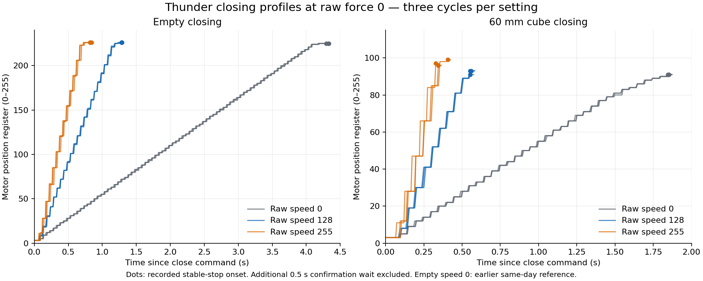

# Closing speed comparison — 2026-10-06

Five additional recordings compare raw speeds 0, 128 and 255 while keeping raw force at 0. Each new recording completed three close/open cycles, with no recorded faults or cleanup errors. Every cube close reported `STOPPED_INNER_OBJECT`, every empty close reported `AT_DEST`, and every opening reached the calibrated open position. Calibration endpoints were 3/226 for all runs. The deployment default remains 0/0; these recordings compare candidate speeds and do not select a new operating point.

The raw files and plot are unchanged copies from `data/gripper_speed_comparison_8YLDE3`. The [comparison review](speed_comparison.review.json) contains per-cycle measurements, source checksums, validation checks, interpretation and limitations. Its source links are relative to this directory; the earlier empty speed0 recording is referenced from the existing archive without duplication. The [parent manifest](../manifest.json) covers all files here.

| Raw speed / force | Empty close, mean | Cube close, mean (range) | Final cube motor positions |
| --- | ---: | ---: | --- |
| 0 / 0 | 4.317 s* | 1.849 s (1.846–1.852) | 91, 91, 91 |
| 128 / 0 | 1.284 s | 0.555 s (0.552–0.559) | 91, 93, 93 |
| 255 / 0 | 0.828 s | 0.360 s (0.328–0.406) | 97, 96, 99 |

*Empty speed0 uses the [earlier same-day reference](../recordings/profile_empty.npz). The other five recordings were collected in this new comparison batch.*

Closing time runs from issuing the command to the onset of the final continuous unchanged stopped register/status interval. The extra 0.5 s confirmation wait is excluded. Communication and register-reporting latency are included. These are motor-register trajectories, not directly measured TPU fingertip trajectories.

## Raw recordings

- [Empty, speed 128 / force 0](recordings/profile_empty_s128_f0.npz)
- [60 mm cube, speed 0 / force 0](recordings/profile_cube60_s0_f0.npz)
- [60 mm cube, speed 128 / force 0](recordings/profile_cube60_s128_f0.npz)
- [Empty, speed 255 / force 0](recordings/profile_empty_s255_f0.npz)
- [60 mm cube, speed 255 / force 0](recordings/profile_cube60_s255_f0.npz)

## Interpretation for simulation

The mean cube closing time improved by 3.33 times at speed128 and 5.14 times at speed255 relative to speed0. Speed255 was 1.54 times faster than speed128. These observations constrain candidate timing targets of approximately 0.555 s and 0.360 s under this grasp geometry. A simulation timing match has not yet been measured using the same starting opening and contact geometry.

Speed128 gave closely grouped reported times in this three-cycle batch. Speed255 stopped at higher motor positions, which could reflect dynamic grasp deformation or placement differences; these measurements do not separate those causes. The operator was instructed to keep the same contact height and orientation, but height was not measured or independently confirmed. Motor position cannot be converted into a loaded TPU fingertip gap without additional geometry measurements.

One speed255 cycle first reported a stopped state at 0.355 s with position98, then reported position99 at 0.406 s, extending its stable-stop time. Another first reported stopped status with position84, then position97 one sample later. Position and status are read sequentially, and firmware register updates are discrete. Those observations alone do not establish physical motion after stopping.

These profiles contain no wrist force measurements. The earlier approximately 8 N resisted-pull target applies to closing at speed0 / force0; repeat the resisted-pull measurement at the chosen faster speed before assuming the same holding behavior. Three cycles per setting describe this batch and do not establish a statistical repeatability tolerance.
